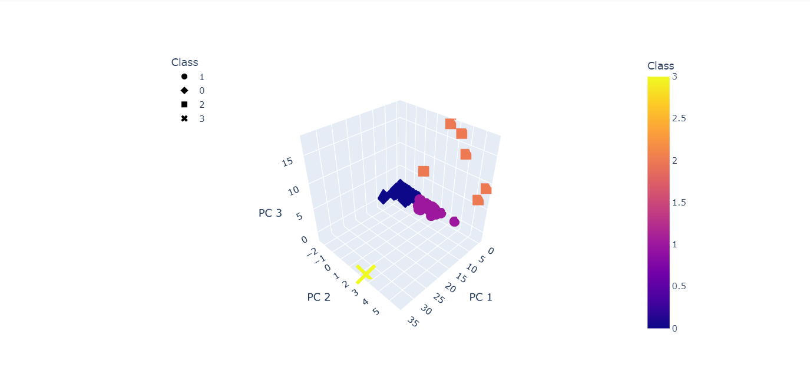

# Cryptocurrencies
Analysing trends in the cryptocurrencies market using unsupervised machine learning techniques.

## Purpose and Overview of the project

1. Unsupervised machine learning is used to discover patterns or groups in data when there is no known output and only the input data.

2. In this project we have used the K-Means and the clustering algorithm , where we group the data into clusters where belonging to a 
   cluster is based on some similarity or distance measure to a centroid.
   
3. We have used a cryptocurrency dataset with fields like totalcoins mined and supplied , bitcoin name and their trading and so on. We have first preprocessed the data using Pandas,
   like to remove null values and include only the necessary information in the dataset. Also we need to scale the data so that they are normalized and can be easily visualized.
   
4. Then we have used the PCA method that is the Principal Component Analysis to reduce the number of dimensions to three principal components and place these components in a 
   new data frame.
   
5. We created an elbow curve to determine the number of clusters and then used K-means algorithm to predict the K clusters for the cryptocurrencies’ data. The model makes predictions
   on the K-clusters of the cryptocurrencies’ data.
   
6. As we can see from the image below there are a total of 532 tradable cryptocurrencies which are available for trading and have already been mined. The table shows all the 532
   crypto currencies that are tradable along with their coin name and their mining and supply in the market.

	
	
7. Following plots give us a 3-D visualization and 2-D plots visualization for the distinct groups or clusters that correspond to the three principal components.
	As we can see from the plot , the data is divided into four clusters along the three principal components (scaled values). The 2-D plot gives us an idea that most of the 
	cryptocurrencies belong to class 0 and 1 . Also if the TotalCoinsSupply is 0 , those crypto currencies have a constant flow of new assets added to the ecosystem.
	
	
	
	
	
	
	
   
